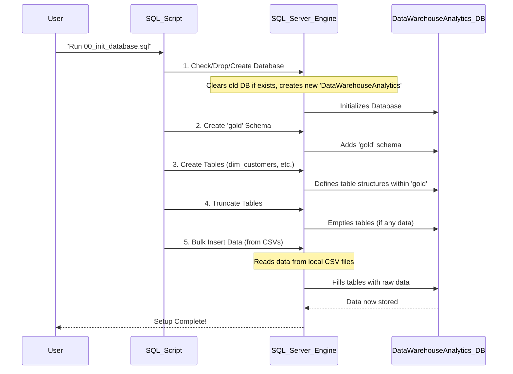
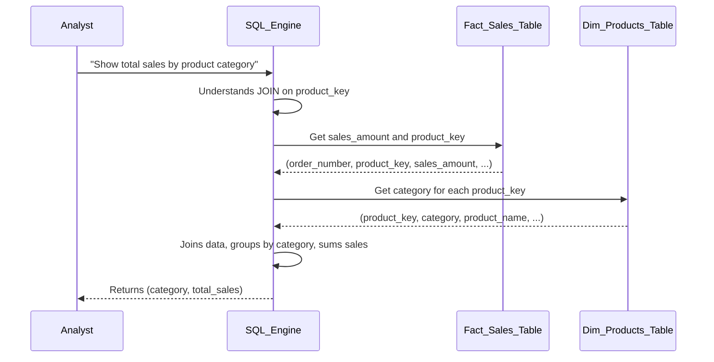
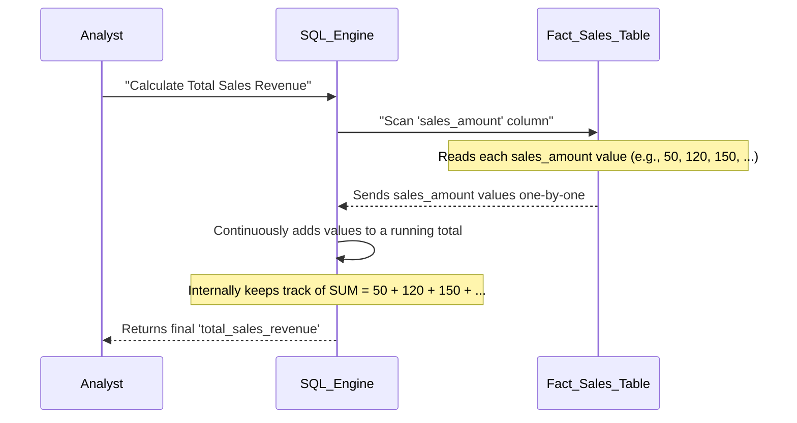
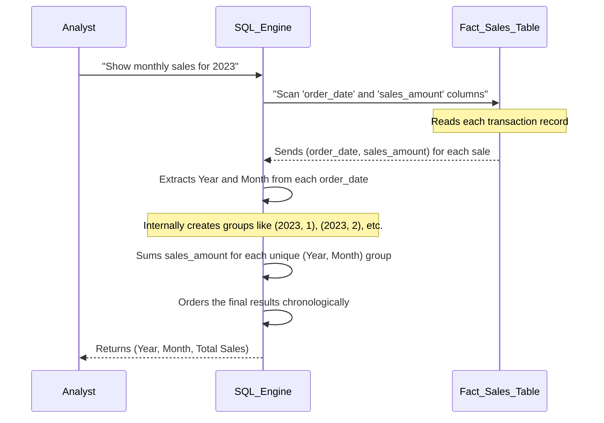
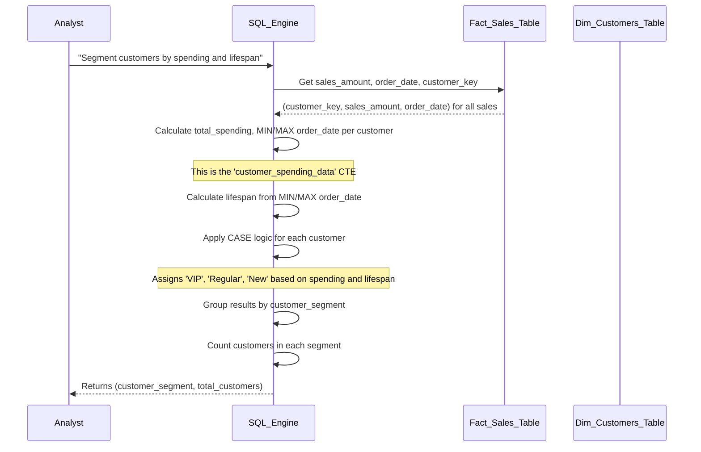
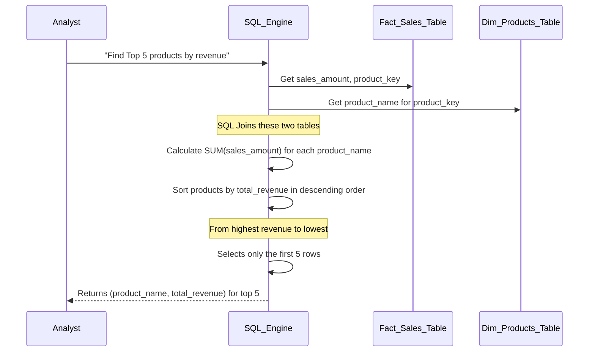
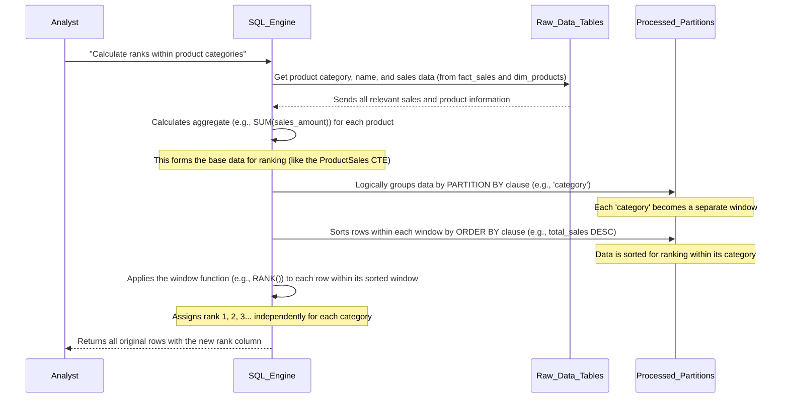
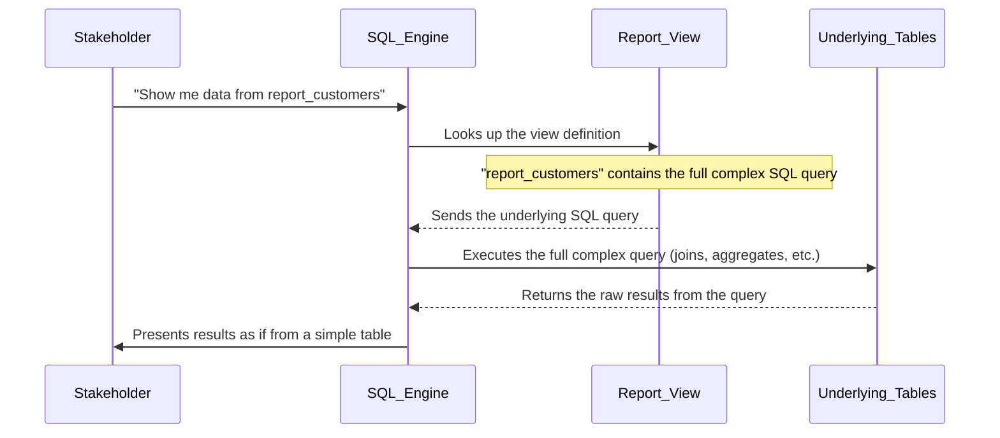

# SQL_Data_Analytics_Project

This project establishes a robust **SQL-based data analytics system** for a data warehouse. It begins by *setting up the database structure* and loading raw data into organized tables. Advanced SQL techniques are then applied to calculate *Key Performance Indicators*, identify *time-based trends*, segment customers and products, and perform *complex calculations using window functions*. The ultimate goal is to generate *integrated business reports* that provide actionable insights for informed decision-making across various business aspects.


## Visual Overview

(docs/Project Roadmap.png)

## Chapters

1. [Database Structure & Initialization
]
2. [Data Modeling (Dimensions & Facts)
]
3. [Key Performance Indicators (KPIs)
]
4. [Time-Series Analytics
]
5. [Data Segmentation & Ranking
]
6. [Advanced SQL Window Functions
]
7. [Integrated Business Reports
]

---

# Chapter 1: Database Structure & Initialization

Welcome to the exciting world of SQL data analytics! In this first chapter, we're going to lay the foundation for our entire project. Think of it like building a house: before you can even think about decorating or living in it, you need to build the actual house, right? That's what this chapter is all about – setting up our digital "house" where all our valuable data will live.

### What's the Big Idea?

Imagine you're running an online store, and you have tons of information scattered everywhere: customer lists in one file, product details in another, and daily sales records in many more. How do you bring all this together to answer important questions like "Which product sold the most last month?" or "Who are our most loyal customers?"

This is where **Database Structure & Initialization** comes in. It's the crucial first step where we:
1.  **Create a central home** for all our data (a database).
2.  **Organize this home** into logical sections (schemas).
3.  **Build specific storage units** within these sections (tables) designed to hold customer info, product details, and sales transactions.
4.  **Load our raw data** into these organized storage units, making it ready for analysis.

By the end of this chapter, you'll understand how we set up this analytical environment, preparing it to answer all sorts of business questions.

### Key Concepts

Let's break down the main ideas we'll be covering:

#### 1. The Database: Our Digital Filing Cabinet

At its core, a **database** is like a giant, super-organized digital filing cabinet. Instead of physical folders, it stores information electronically. Our project will use a database named `DataWarehouseAnalytics`. This is where all our analytical data will reside.

#### 2. Schemas: Organized Drawers within the Cabinet

Inside our big filing cabinet (the database), we need to keep things tidy. That's where **schemas** come in. A schema is like a specific drawer or section within your database. It helps you group related tables together.

In our project, we'll create a schema called `gold`. We call it `gold` because it will hold our highest quality, cleaned, and transformed data – the "gold standard" of our information, ready for analysis.

#### 3. Tables: Specific Folders for Your Data

Within a schema (like our `gold` drawer), we create **tables**. A table is like a specific folder designed to hold one type of information. Each table has columns (like sections in a form, e.g., "Customer Name," "Product Price") and rows (individual records, e.g., one customer's full details).

We will create three essential tables in our `gold` schema:

*   `gold.dim_customers`: This table will store all the details about our customers (like their name, country, birthdate).
*   `gold.dim_products`: This table will contain information about all the products we sell (like product name, category, cost).
*   `gold.fact_sales`: This table will record every individual sale transaction (like which product was sold, to which customer, when, and for how much).

These tables are crucial for organizing our data in a way that makes it easy to analyze later.

#### 4. Loading Data: Filling the Folders

Once our database, schema, and tables are set up, they're empty. The final step is to **load data** into them. This means taking our raw information, which might be in separate files (like CSV files – think of them as simple spreadsheets), and importing it into our newly created tables. This fills our "folders" with the actual information we want to analyze.

### Setting Up Our Analytical Environment

Let's see how all these concepts come together in our project. We use a SQL script named `00_init_database.sql` to perform all these setup steps.

First, the script ensures we have a clean slate. It checks if our `DataWarehouseAnalytics` database already exists. If it does, it deletes it and creates a fresh one.

```sql
USE master;
GO

-- Drop and recreate the 'DataWarehouseAnalytics' database
IF EXISTS (SELECT 1 FROM sys.databases WHERE name = 'DataWarehouseAnalytics')
BEGIN
    ALTER DATABASE DataWarehouseAnalytics SET SINGLE_USER WITH ROLLBACK IMMEDIATE;
    DROP DATABASE DataWarehouseAnalytics;
END;
GO

-- Create the 'DataWarehouseAnalytics' database
CREATE DATABASE DataWarehouseAnalytics;
GO

USE DataWarehouseAnalytics;
GO
```
**What's Happening Here?**
*   `USE master;`: We tell SQL Server to work with a special `master` database first, which manages other databases.
*   `IF EXISTS ... DROP DATABASE ...`: This is a safety check. If a database named `DataWarehouseAnalytics` already exists, we forcefully remove it. This ensures we start fresh every time.
*   `CREATE DATABASE DataWarehouseAnalytics;`: We create our main digital filing cabinet.
*   `USE DataWarehouseAnalytics;`: Now that our new database exists, we switch our focus to it, so all subsequent commands happen inside this database.

Next, we create our `gold` schema:

```sql
-- Create Schemas
CREATE SCHEMA gold;
GO
```
**What's Happening Here?**
*   `CREATE SCHEMA gold;`: This creates our "gold standard" drawer within the `DataWarehouseAnalytics` database. From now on, any tables we create for analytics will be placed inside this `gold` schema.

Then, we define the structure of our tables – `dim_customers`, `dim_products`, and `fact_sales`:

```sql
CREATE TABLE gold.dim_customers(
	customer_key int,
	customer_id int,
	customer_number nvarchar(50),
	first_name nvarchar(50),
	last_name nvarchar(50),
	country nvarchar(50),
	marital_status nvarchar(50),
	gender nvarchar(50),
	birthdate date,
	create_date date
);
GO
```
**What's Happening Here?**
*   `CREATE TABLE gold.dim_customers(...)`: We're creating a new table named `dim_customers` *inside* the `gold` schema.
*   `customer_key int, customer_id int, ...`: These lines define the "sections" or columns of our `dim_customers` table. Each column has a name (like `first_name`) and a data type (like `nvarchar(50)` for text up to 50 characters, or `date` for dates, `int` for whole numbers). This tells the database exactly what kind of information each section will hold.

Similar `CREATE TABLE` statements are used for `gold.dim_products` and `gold.fact_sales` to define their respective columns.

Finally, we load the data from our external CSV files into these newly created tables:

```sql
TRUNCATE TABLE gold.dim_customers;
GO

BULK INSERT gold.dim_customers
FROM 'C:\sql\sql-data-analytics-project\datasets\csv-files\gold.dim_customers.csv'
WITH (
	FIRSTROW = 2,
	FIELDTERMINATOR = ',',
	TABLOCK
);
GO
```
**What's Happening Here?**
*   `TRUNCATE TABLE gold.dim_customers;`: This command clears out any existing data from the `dim_customers` table. It's a cleanup step before loading fresh data.
*   `BULK INSERT gold.dim_customers ... FROM '...'`: This powerful command tells the database to read data from a specified file (in this case, `gold.dim_customers.csv`) and insert it directly into our `gold.dim_customers` table.
*   `WITH (FIRSTROW = 2, FIELDTERMINATOR = ',', TABLOCK)`: These are options for `BULK INSERT`:
    *   `FIRSTROW = 2`: Tells the database to skip the first row of the CSV file, as it usually contains column headers, not actual data.
    *   `FIELDTERMINATOR = ','`: Specifies that commas are used to separate values in the CSV file.
    *   `TABLOCK`: Helps speed up the loading process by locking the table.

**Important Note on Paths:** The file path `'C:\sql\sql-data-analytics-project\datasets\csv-files\gold.dim_customers.csv'` is specific to where the files are located on your computer. You might need to adjust this path to match your project's directory structure.

Similar `TRUNCATE` and `BULK INSERT` commands are used for `gold.dim_products.csv` and `gold.fact_sales.csv` to load their data.

### Under the Hood: How It All Works

When you run the `00_init_database.sql` script, here's a simplified sequence of events:



Once the script finishes, your `DataWarehouseAnalytics` database is fully set up, organized with the `gold` schema, and populated with the initial data in `dim_customers`, `dim_products`, and `fact_sales` tables.

To quickly confirm that our tables are indeed created and visible, we can run a quick exploration script like `01_database_exploration.sql`.

```sql
-- scripts/01_database_exploration.sql
SELECT
    TABLE_CATALOG,
    TABLE_SCHEMA,
    TABLE_NAME,
    TABLE_TYPE
FROM INFORMATION_SCHEMA.TABLES;
```
**What to Expect:**
Running this query will show you a list of all tables in your `DataWarehouseAnalytics` database. You should see entries like:

| TABLE\_CATALOG        | TABLE\_SCHEMA | TABLE\_NAME     | TABLE\_TYPE |
| :-------------------- | :------------ | :-------------- | :---------- |
| DataWarehouseAnalytics | gold          | dim\_customers  | BASE TABLE  |
| DataWarehouseAnalytics | gold          | dim\_products   | BASE TABLE  |
| DataWarehouseAnalytics | gold          | fact\_sales     | BASE TABLE  |

This confirms that our tables were successfully created within the `gold` schema.

You can also inspect the columns of a specific table:

```sql
-- scripts/01_database_exploration.sql (part 2)
SELECT
    COLUMN_NAME,
    DATA_TYPE,
    IS_NULLABLE,
    CHARACTER_MAXIMUM_LENGTH
FROM INFORMATION_SCHEMA.COLUMNS
WHERE TABLE_NAME = 'dim_customers';
```
**What to Expect:**
This query will list all the columns for the `dim_customers` table, showing their names, data types, and other details. This helps verify that the table structure we defined was correctly applied.

### Conclusion

In this chapter, we've successfully built the foundation for our data analytics project. We learned about creating a database, organizing it with schemas, defining tables to hold specific types of data, and loading initial information into these tables. Our digital "house" is now built and furnished with raw data, ready for us to start analyzing!

In the [Next Chapter: Data Modeling (Dimensions & Facts)](02_data_modeling__dimensions___facts__.md), we'll dive deeper into *why* we structured our tables specifically as `dim_customers`, `dim_products`, and `fact_sales`, and how this design is fundamental for powerful analytics.

---

# Chapter 2: Data Modeling (Dimensions & Facts)

Welcome back, aspiring data analyst! In [Chapter 1: Database Structure & Initialization](01_database_structure___initialization_.md), we successfully built our digital "house"—the `DataWarehouseAnalytics` database—and furnished it with three empty rooms, `gold.dim_customers`, `gold.dim_products`, and `gold.fact_sales`, before filling them with raw data. We now have a place for our data, but *why* did we organize it into these specific table types?

This chapter will reveal the secret behind that structure: **Data Modeling** using a powerful concept called **Dimensions and Facts**. Understanding this is like learning the blueprint of our data house, which makes finding answers to business questions much easier and faster.

### What's the Big Idea?

Imagine you run an online store and want to answer a simple question: "What were the total sales for each product category (like 'Electronics' or 'Clothing') last month?"

If all your data was in one giant, messy table, finding this answer would be like rummaging through a cluttered garage. You'd have to sift through every single sale record, trying to figure out which product category each one belongs to. It would be slow and prone to errors.

**Data Modeling (Dimensions & Facts)** solves this problem by organizing our data into two distinct, but interconnected, types of tables:

*   **Dimension Tables:** These tables provide descriptive *context*. They tell you the "who, what, where, when, and how" about your business.
*   **Fact Tables:** These tables record *measurable events* or *transactions*. They tell you the "how much" and "how many" of your business activities.

This structured approach makes it incredibly efficient to query business events (like sales) alongside their detailed context (like product category or customer demographics).

### Key Concepts

Let's break down these two crucial table types.

#### 1. Dimension Tables: Your Detailed Catalogs

Think of **Dimension tables** as comprehensive catalogs or detailed descriptive lists. They hold all the background information you might need to understand an event. They answer questions like:

*   **Who** made a purchase? (Customer details)
*   **What** product was sold? (Product details)
*   **Where** is the customer from? (Country)
*   **When** did the product become available? (Start date)

In our project, we created two dimension tables:

*   `gold.dim_customers`: This is our customer catalog. It lists every customer with all their personal details like name, country, age, and marital status.
*   `gold.dim_products`: This is our product catalog. It lists every product we sell, along with details like its name, category, subcategory, and cost.

These tables are generally stable and change less frequently. Their purpose is to provide rich descriptive attributes.

Here's a simplified look at what a `gold.dim_customers` table might contain:

| customer_key | customer_id | first_name | last_name | country   | gender | birthdate  |
| :----------- | :---------- | :--------- | :-------- | :-------- | :----- | :--------- |
| 1            | 101         | Alice      | Smith     | USA       | Female | 1985-05-10 |
| 2            | 102         | Bob        | Johnson   | Canada    | Male   | 1992-11-23 |
| 3            | 103         | Carol      | White     | Australia | Female | 1978-01-15 |

Notice the `customer_key`? This is a special ID that uniquely identifies each customer. It's super important for linking!

#### 2. Fact Tables: Your Event Logbook

**Fact tables** are where the action happens! These tables record every single measurable event or transaction in your business. They hold the numerical metrics that you want to analyze. They answer questions like:

*   **How much** was sold? (Sales amount)
*   **How many** items were sold? (Quantity)
*   **When** did the sale occur? (Order date)

In our project, we have one fact table:

*   `gold.fact_sales`: This is our sales logbook. Every time a product is sold, a new record is added here. It contains numerical metrics like `sales_amount` and `quantity`, along with dates related to the transaction.

Crucially, fact tables don't store descriptive details directly. Instead, they contain **keys** (special IDs) that link back to the relevant dimension tables.

Here's a simplified look at what a `gold.fact_sales` table might contain:

| order_number | product_key | customer_key | order_date | sales_amount | quantity |
| :----------- | :---------- | :----------- | :--------- | :----------- | :------- |
| ORD001       | 1001        | 1            | 2023-01-05 | 50           | 1        |
| ORD002       | 1002        | 2            | 2023-01-05 | 120          | 2        |
| ORD003       | 1001        | 1            | 2023-01-06 | 150          | 3        |
| ORD004       | 1003        | 3            | 2023-01-07 | 75           | 1        |

See how `product_key` and `customer_key` are in this table? These are the "bridges" that connect `fact_sales` to `dim_products` and `dim_customers`.

#### The Connection: Keys are the Glue!

The magic of data modeling lies in how dimension tables and fact tables are linked together. This is done using **keys**.

*   Each record in a dimension table has a unique identifier, like `customer_key` or `product_key`. These are called **primary keys** in their respective dimension tables.
*   The fact table then includes these keys (they are called **foreign keys** in the fact table) to point to the relevant descriptive information in the dimension tables.

Think of it like this: your `fact_sales` table only records "Customer 1 bought Product 1001 for $50." To know *who* Customer 1 is (Alice Smith from USA) or *what* Product 1001 is (a "Laptop" in "Electronics"), you follow the `customer_key` and `product_key` to `dim_customers` and `dim_products`.

### Solving Our Use Case: Sales by Product Category

Let's go back to our initial question: "What were the total sales for each product category?"

With our data modeled into dimensions and facts, this question becomes simple to answer. We need two things:
1.  The `sales_amount` from `gold.fact_sales`.
2.  The `category` from `gold.dim_products`.

We can connect these two tables using the `product_key` that exists in both!

```sql
SELECT
    dp.category,               -- We want the product category
    SUM(fs.sales_amount) AS total_sales -- And the sum of sales amounts
FROM
    gold.fact_sales AS fs      -- Start with our sales events
JOIN
    gold.dim_products AS dp    -- Link it to the product details
ON
    fs.product_key = dp.product_key -- Using the product_key as our bridge
GROUP BY
    dp.category;               -- Group the results by category
```

**What This Code Does:**
This SQL query first connects (`JOIN`) our `fact_sales` table (where sales events are recorded) with our `dim_products` table (where product categories are defined). It links them using the common `product_key`. Then, for each unique `category`, it sums up all the `sales_amount` values from the linked sales records.

**What to Expect (Example Output):**

| category    | total_sales |
| :---------- | :---------- |
| Electronics | 15000       |
| Clothing    | 8000        |
| Books       | 3500        |
| ...         | ...         |

This structured data model allows us to easily combine different pieces of information to gain powerful insights.

### Under the Hood: How Data Modeling Works

When you run a query like the one above, SQL Server doesn't just pull data randomly. It understands the relationships we've established.

Here's a simplified sequence of events for our "sales by category" query:



The SQL Engine efficiently combines the detailed events from the fact table with the descriptive context from the dimension table to give you the exact answer you need.

#### How We Built Our Dimension and Fact Tables

In [Chapter 1: Database Structure & Initialization](01_database_structure___initialization_.md), we used the `00_init_database.sql` script to create our tables. Let's look at the `CREATE TABLE` statements again, specifically focusing on how they define our dimensions and facts.

Here's how `gold.dim_customers` was created, clearly showing its descriptive nature:

```sql
-- From scripts/00_init_database.sql
CREATE TABLE gold.dim_customers(
	customer_key int,          -- Unique ID for each customer (our primary key)
	customer_id int,
	customer_number nvarchar(50),
	first_name nvarchar(50),
	last_name nvarchar(50),
	country nvarchar(50),      -- Descriptive context
	marital_status nvarchar(50),
	gender nvarchar(50),
	birthdate date,
	create_date date
);
GO
```
**What's Happening Here?**
This table has `customer_key` as its unique identifier. All other columns (`first_name`, `country`, `birthdate`, etc.) are descriptive attributes, providing rich context about each customer.

Similarly, `gold.dim_products` stores descriptive product information:

```sql
-- From scripts/00_init_database.sql
CREATE TABLE gold.dim_products(
	product_key int ,          -- Unique ID for each product
	product_id int ,
	product_number nvarchar(50) ,
	product_name nvarchar(50) ,
	category_id nvarchar(50) ,
	category nvarchar(50) ,    -- Descriptive context like 'Electronics'
	subcategory nvarchar(50) ,
	maintenance nvarchar(50) ,
	cost int,
	product_line nvarchar(50),
	start_date date
);
GO
```
**What's Happening Here?**
This table uses `product_key` as its unique identifier. It contains descriptive attributes like `product_name`, `category`, and `subcategory`, which provide context about each product.

And finally, `gold.fact_sales` is designed to record events and link to dimensions:

```sql
-- From scripts/00_init_database.sql
CREATE TABLE gold.fact_sales(
	order_number nvarchar(50),
	product_key int,           -- Foreign key linking to dim_products
	customer_key int,          -- Foreign key linking to dim_customers
	order_date date,
	shipping_date date,
	due_date date,
	sales_amount int,          -- Measurable metric (the 'fact')
	quantity tinyint,          -- Another measurable metric
	price int
);
GO
```
**What's Happening Here?**
The `fact_sales` table records `sales_amount` and `quantity` (our numerical facts). Instead of repeating customer names or product categories here, it simply includes `customer_key` and `product_key`. These are our "foreign keys" that act as pointers, allowing us to easily look up the full customer and product details from their respective dimension tables whenever we need them.

To get a quick look at the data inside our dimension tables, you can use a script like `02_dimensions_exploration.sql`. For instance, to see all the unique countries our customers are from:

```sql
-- From scripts/02_dimensions_exploration.sql
SELECT DISTINCT
    country
FROM gold.dim_customers
ORDER BY country;
```
**What to Expect:**
This query will show a clear list of unique countries, demonstrating how a dimension table stores discrete, descriptive attributes.

| country   |
| :-------- |
| Australia |
| Canada    |
| USA       |
| ...       |

### Dimension vs. Fact Tables: A Quick Summary

Here's a quick comparison to help solidify your understanding:

| Feature           | Dimension Table                        | Fact Table                                 |
| :---------------- | :------------------------------------- | :----------------------------------------- |
| **Purpose**       | Provides descriptive context           | Records measurable events/transactions     |
| **Content**       | "Who, What, Where, When" details       | "How much, How many" metrics               |
| **Columns**       | Descriptive attributes (names, types)  | Numerical metrics + Keys to dimensions     |
| **Size**          | Fewer rows, more columns               | Many rows, fewer columns                   |
| **Change Rate**   | Generally stable, less frequent changes| Highly dynamic, new rows constantly added  |
| **Example Data**  | Customer name, Product category        | Sales amount, Quantity                     |
| **Key Role**      | Primary Keys (e.g., `customer_key`)    | Foreign Keys (e.g., `customer_key`)        |

### Conclusion

In this chapter, you've learned the fundamental principles of **Data Modeling** using **Dimensions and Facts**. You now understand why we structured our data this way: to create an organized, efficient system for powerful analytics. Dimension tables provide context, fact tables record events and measurements, and keys are the glue that connects them all. This structure is the backbone of any robust analytical database.

In the [Next Chapter: Key Performance Indicators (KPIs)](03_key_performance_indicators__kpis__.md), we'll build upon this foundation to define and calculate important business metrics that help us measure performance and make informed decisions.

---

# Chapter 3: Key Performance Indicators (KPIs)

Welcome back, future data guru! In [Chapter 1: Database Structure & Initialization](01_database_structure___initialization_.md), we built our data "house" and organized it. Then, in [Chapter 2: Data Modeling (Dimensions & Facts)](02_data_modeling__dimensions___facts__.md), we learned the blueprint of that house – how `dim_customers`, `dim_products`, and `fact_sales` work together. Now, it's time to actually *use* that organized data to understand how our business is doing!

### What's the Big Idea?

Imagine you're running that online store again. You've got all your sales data neatly stored. But how do you know if you're having a good day, week, or year? How do you quickly tell if sales are up or down, or if you're serving more customers?

This is where **Key Performance Indicators (KPIs)** come in. KPIs are like the vital signs of your business. They are essential numerical measurements that tell you, at a glance, how well your business is performing against its goals. Think of it as taking the pulse of your business; these core measures provide a quick, high-level overview of overall health and allow you to track success or identify areas needing attention.

For example, you might want to know:
*   What's our **total sales revenue** for the month?
*   How many **orders** did we receive today?
*   What's the **average price** customers pay for our products?
*   How many **unique customers** have we served this year?

KPIs help us answer these questions with clear, quantifiable numbers.

### Key Concepts: The Building Blocks of KPIs

KPIs are all about summarizing and counting things in your data. To do this, we use special SQL functions called **aggregate functions**. These functions take many values and condense them into a single result.

Here are the most common aggregate functions we'll use for KPIs:

*   **`SUM()`**: Adds up all the numbers in a column.
    *   *Example:* `SUM(sales_amount)` will give you the total sales revenue.
*   **`COUNT()`**: Counts how many rows (or non-empty values) are in a column.
    *   *Example:* `COUNT(order_number)` will tell you the total number of entries in that column. `COUNT(DISTINCT order_number)` will count only unique order numbers, which is usually what you want for "total orders."
*   **`AVG()`**: Calculates the average value of numbers in a column.
    *   *Example:* `AVG(price)` will give you the average selling price.

These functions are typically used on the numerical fields found in our `gold.fact_sales` table (like `sales_amount`, `quantity`, `price`) or to count unique identifiers from our dimension tables.

### Calculating Our First KPIs

Let's use our `DataWarehouseAnalytics` database to calculate some fundamental KPIs. We'll be using our `gold.fact_sales` table, which holds all our transaction data, and occasionally our `gold.dim_customers` or `gold.dim_products` for counting unique entities.

#### 1. Total Sales Revenue

This KPI tells us the total money earned from all sales. We'll use the `SUM()` function on the `sales_amount` column in our `gold.fact_sales` table.

```sql
SELECT
    SUM(sales_amount) AS total_sales_revenue
FROM
    gold.fact_sales;
```

**What This Code Does:**
This query goes through every record in the `gold.fact_sales` table, takes the `sales_amount` from each, and adds them all up. The `AS total_sales_revenue` part just gives our result a nice, readable name.

**What to Expect (Example Output):**

| total_sales_revenue |
| :------------------ |
| 452100              |

#### 2. Total Number of Orders

This KPI tells us how many distinct (unique) orders customers have placed. We'll use `COUNT(DISTINCT order_number)` from `gold.fact_sales`. Using `DISTINCT` ensures we don't count multiple items within the same order as separate orders.

```sql
SELECT
    COUNT(DISTINCT order_number) AS total_orders
FROM
    gold.fact_sales;
```

**What This Code Does:**
This query looks at all the `order_number` values in the `gold.fact_sales` table. It then counts how many *different* order numbers there are, giving us the total number of unique orders.

**What to Expect (Example Output):**

| total_orders |
| :----------- |
| 2500         |

#### 3. Average Selling Price

This KPI gives us the average price of items sold. We'll use `AVG()` on the `price` column in `gold.fact_sales`.

```sql
SELECT
    AVG(price) AS average_selling_price
FROM
    gold.fact_sales;
```

**What This Code Does:**
The `AVG()` function takes all the `price` values from our sales records, adds them up, and then divides by the total number of prices to find the average.

**What to Expect (Example Output):**

| average_selling_price |
| :-------------------- |
| 120.50                |

#### 4. Total Unique Customers Who Placed Orders

This KPI tells us how many different customers have bought something. We'll use `COUNT(DISTINCT customer_key)` from `gold.fact_sales`.

```sql
SELECT
    COUNT(DISTINCT customer_key) AS total_unique_customers
FROM
    gold.fact_sales;
```

**What This Code Does:**
Similar to `total_orders`, this query counts the number of unique `customer_key` values in the `gold.fact_sales` table, which represents each distinct customer who has made at least one purchase.

**What to Expect (Example Output):**

| total_unique_customers |
| :--------------------- |
| 500                    |

#### 5. Total Products Available (or Sold)

If you want to know the total number of unique products *listed* in your catalog, you'd check `gold.dim_products`. If you want to know how many *different products have been sold*, you'd check `gold.fact_sales`. Let's count products from our `gold.dim_products` table.

```sql
SELECT
    COUNT(product_key) AS total_products_in_catalog
FROM
    gold.dim_products;
```

**What This Code Does:**
This counts every `product_key` in the `gold.dim_products` table, giving you the total number of distinct products you offer.

**What to Expect (Example Output):**

| total_products_in_catalog |
| :------------------------ |
| 150                       |

### Under the Hood: How SQL Calculates KPIs

When you run an aggregate function like `SUM()` or `COUNT()`, SQL Server works its magic efficiently. It doesn't need to load the entire table into memory at once to do the calculation.

Here's a simplified view of how SQL calculates something like "Total Sales Revenue":



The SQL engine is optimized to perform these summations, counts, and averages very quickly, even on very large datasets.

The code snippets we've used are directly inspired by `scripts/04_measures_exploration.sql`, which provides a collection of similar KPI calculations. For example, the `total_orders` calculation:

```sql
-- From scripts/04_measures_exploration.sql
-- Find the Total number of Orders
SELECT COUNT(DISTINCT order_number) AS total_orders FROM gold.fact_sales
```

### Consolidating KPIs: A Business Snapshot

Often, you don't just want one KPI; you want a quick overview of several key metrics together. We can combine multiple KPI queries into a single report using the `UNION ALL` operator. This stacks the results of several `SELECT` statements on top of each other.

```sql
SELECT 'Total Sales Revenue' AS KPI_Name, SUM(sales_amount) AS KPI_Value FROM gold.fact_sales
UNION ALL
SELECT 'Total Orders', COUNT(DISTINCT order_number) FROM gold.fact_sales
UNION ALL
SELECT 'Average Selling Price', AVG(price) FROM gold.fact_sales
UNION ALL
SELECT 'Total Unique Customers', COUNT(DISTINCT customer_key) FROM gold.fact_sales
UNION ALL
SELECT 'Total Products in Catalog', COUNT(product_key) FROM gold.dim_products;
```

**What This Code Does:**
Each `SELECT` statement calculates a single KPI. `UNION ALL` then stitches these individual results together into one table with two columns: `KPI_Name` (describing the metric) and `KPI_Value` (the calculated number).

**What to Expect (Example Output):**

| KPI_Name                  | KPI_Value |
| :------------------------ | :-------- |
| Total Sales Revenue       | 452100    |
| Total Orders              | 2500      |
| Average Selling Price     | 120       |
| Total Unique Customers    | 500       |
| Total Products in Catalog | 150       |

This single report gives you a powerful, at-a-glance snapshot of your business's core performance, making it easy to monitor and share. This specific query is also available in `scripts/04_measures_exploration.sql`.

### Conclusion

In this chapter, you've taken a crucial step into understanding your business's health by learning about **Key Performance Indicators (KPIs)**. You now know how to use powerful SQL aggregate functions like `SUM()`, `COUNT()`, and `AVG()` to extract essential numerical metrics from your well-structured data. These KPIs provide a clear, quantifiable way to measure performance and are the foundation for any deeper analysis.

In the [Next Chapter: Time-Series Analytics](04_time_series_analytics_.md), we'll add another important dimension to our KPIs: time! We'll learn how to track these metrics over periods like days, months, or years to see trends and changes.

---

# Chapter 4: Time-Series Analytics

Welcome back, data explorer! In [Chapter 1: Database Structure & Initialization](01_database_structure___initialization_.md), we built our data house. In [Chapter 2: Data Modeling (Dimensions & Facts)](02_data_modeling__dimensions___facts__.md), we learned its blueprint. And in [Chapter 3: Key Performance Indicators (KPIs)](03_key_performance_indicators__kpis__.md), we learned how to measure the health of our business with metrics like total sales or total orders.

Now, imagine you've calculated your total sales for the entire history of your online store. That's a great number, but it doesn't tell you if sales are getting better or worse. Are you selling more this month than last month? Are your holiday sales higher than last year's?

This is where **Time-Series Analytics** comes in! It's all about adding the dimension of *time* to your KPIs. Instead of just knowing "how much," you'll learn "how much *when*."

### What's the Big Idea?

Think of your business data as a story. KPIs give you a snapshot of a moment in that story. Time-Series Analytics helps you read the entire book, chapter by chapter, to understand the plot!

It's about understanding how your business metrics (like sales, customer counts, or average prices) change and evolve over different periods. You might look at data by:
*   **Years**: Is our business growing year after year?
*   **Quarters**: How did the first quarter compare to the second?
*   **Months**: Are our monthly sales going up or down?
*   **Days**: What were our sales on each day of the week?

By analyzing data across time, we can:
1.  **Spot Trends**: Is there a general upward or downward movement over a long period?
2.  **Detect Seasonality**: Do sales always spike in December for the holidays or drop in summer?
3.  **Measure Growth or Decline**: How much did sales increase (or decrease) compared to last year?
4.  **Forecast**: Based on past patterns, what might happen in the future?

This type of analysis is super important for making smart business decisions. For example, our use case for this chapter will be to **track monthly sales performance** for our online store.

### Key Concepts: Working with Dates

To perform time-series analysis, we need to extract different parts of a date (like the year, month, or day) from our `order_date` column in the `gold.fact_sales` table. SQL provides handy functions for this.

#### 1. Extracting Date Parts: `YEAR()`, `MONTH()`, `DAY()`

These functions are straightforward: they take a date and return the year, month (as a number), or day (as a number).

Let's see the year and month of our sales:

```sql
SELECT
    YEAR(order_date) AS order_year,
    MONTH(order_date) AS order_month,
    SUM(sales_amount) AS total_monthly_sales
FROM
    gold.fact_sales
WHERE
    order_date IS NOT NULL
GROUP BY
    YEAR(order_date),
    MONTH(order_date)
ORDER BY
    order_year,
    order_month;
```

**What This Code Does:**
1.  `YEAR(order_date)`: Pulls out just the year number (e.g., 2023) from each `order_date`.
2.  `MONTH(order_date)`: Pulls out just the month number (e.g., 1 for January, 2 for February).
3.  `SUM(sales_amount)`: Calculates the total sales for each unique combination of year and month.
4.  `GROUP BY YEAR(order_date), MONTH(order_date)`: This is crucial! It tells SQL to group all sales that happened in the same year and month together before summing their `sales_amount`.
5.  `ORDER BY`: Sorts our results nicely by year, then by month.

**What to Expect (Example Output - a small part):**

| order_year | order_month | total_monthly_sales |
| :--------- | :---------- | :------------------ |
| 2022       | 10          | 35000               |
| 2022       | 11          | 42000               |
| 2022       | 12          | 55000               |
| 2023       | 1           | 38000               |
| 2023       | 2           | 40000               |

This output immediately shows us a trend: sales peaked in December 2022, then dipped a bit in January 2023. This query is similar to parts of `scripts/07_change_over_time_analysis.sql`.

#### 2. Formatting Dates for Better Readability: `DATETRUNC()` and `FORMAT()`

Sometimes, you want the date in a more readable format, or you want to group by a specific "start" of a period (like the first day of the month).

*   **`DATETRUNC(part, date)`**: Truncates (cuts off) a date to the beginning of a specified `part` (e.g., year, quarter, month). It's great for consistent grouping.
*   **`FORMAT(date, format_string)`**: Allows you to display a date in almost any text format you want (e.g., "2023-Jan", "January 2023").

Let's use these to get our monthly sales with a nicely formatted month-year string:

```sql
SELECT
    FORMAT(order_date, 'yyyy-MMM') AS sales_month, -- e.g., "2023-Jan"
    SUM(sales_amount) AS total_monthly_sales
FROM
    gold.fact_sales
WHERE
    order_date IS NOT NULL
GROUP BY
    FORMAT(order_date, 'yyyy-MMM') -- Group by the formatted string
ORDER BY
    MIN(order_date); -- Order by the actual date to keep correct chronological order
```

**What This Code Does:**
1.  `FORMAT(order_date, 'yyyy-MMM')`: Converts the `order_date` into a string like "2023-Jan". This makes the output very easy to read.
2.  `GROUP BY FORMAT(order_date, 'yyyy-MMM')`: Groups all sales within the same formatted month string.
3.  `ORDER BY MIN(order_date)`: We order by the minimum `order_date` in each group to ensure the months are listed chronologically, because `FORMAT` outputs a string, and sorting strings alphabetically (e.g., "2023-Apr" before "2023-Jan") would be incorrect.

**What to Expect (Example Output - a small part):**

| sales_month | total_monthly_sales |
| :---------- | :------------------ |
| 2022-Oct    | 35000               |
| 2022-Nov    | 42000               |
| 2022-Dec    | 55000               |
| 2023-Jan    | 38000               |
| 2023-Feb    | 40000               |

This is a cleaner way to show our monthly sales performance. Both `DATETRUNC()` and `FORMAT()` examples are based on `scripts/07_change_over_time_analysis.sql`.

#### 3. Running Totals: Seeing Cumulative Progress

A "running total" or "cumulative sum" shows the total up to a certain point in time. It's like checking your bank balance after each transaction—it keeps adding up. This is great for seeing overall growth.

To calculate a running total, we use a powerful feature called a **Window Function**. We'll cover Window Functions in detail in [Chapter 6: Advanced SQL Window Functions](06_advanced_sql_window_functions_.md), but here's a taste to show how to get a cumulative sum of sales.

```sql
SELECT
    DATETRUNC(month, order_date) AS sales_month,
    SUM(sales_amount) AS monthly_sales,
    SUM(SUM(sales_amount)) OVER (ORDER BY DATETRUNC(month, order_date)) AS running_total_sales
FROM
    gold.fact_sales
WHERE
    order_date IS NOT NULL
GROUP BY
    DATETRUNC(month, order_date)
ORDER BY
    sales_month;
```

**What This Code Does:**
1.  The inner part `DATETRUNC(month, order_date) AS sales_month, SUM(sales_amount) AS monthly_sales ... GROUP BY DATETRUNC(month, order_date)` first calculates the total `monthly_sales` for each month, just like before.
2.  `SUM(SUM(sales_amount)) OVER (ORDER BY DATETRUNC(month, order_date)) AS running_total_sales`: This is the window function part.
    *   `SUM(...) OVER(...)`: This tells SQL to calculate a sum, not for the entire table, but for a "window" of rows.
    *   `ORDER BY DATETRUNC(month, order_date)`: This specifies that the window should consider rows in chronological order. So, for each month, it sums up all `monthly_sales` *up to and including that month*.

**What to Expect (Example Output - a small part):**

| sales_month | monthly_sales | running_total_sales |
| :---------- | :------------ | :------------------ |
| 2022-10-01  | 35000         | 35000               |
| 2022-11-01  | 42000         | 77000               |
| 2022-12-01  | 55000         | 132000              |
| 2023-01-01  | 38000         | 170000              |
| 2023-02-01  | 40000         | 210000              |

This calculation helps us see how our total sales are accumulating over time. This query is similar to `scripts/08_cumulative_analysis.sql`.

#### 4. Comparing to Previous Periods: Year-over-Year (YoY) Growth

A common and very important time-series analysis is comparing current performance to a previous period (like last year or last month). This helps measure growth.

We'll use another window function called `LAG()`. `LAG()` allows you to look back at the value from a *previous* row in your dataset. Again, this is an advanced topic covered in [Chapter 6: Advanced SQL Window Functions](06_advanced_sql_window_functions_.md), but here's a simplified example to show its power for YoY comparison.

Let's calculate yearly sales and then get the previous year's sales.

```sql
WITH yearly_sales AS (
    SELECT
        YEAR(order_date) AS order_year,
        SUM(sales_amount) AS current_year_sales
    FROM
        gold.fact_sales
    WHERE
        order_date IS NOT NULL
    GROUP BY
        YEAR(order_date)
)
SELECT
    order_year,
    current_year_sales,
    LAG(current_year_sales) OVER (ORDER BY order_year) AS previous_year_sales
FROM
    yearly_sales
ORDER BY
    order_year;
```

**What This Code Does:**
1.  `WITH yearly_sales AS (...)`: This is a Common Table Expression (CTE). It first calculates the `current_year_sales` for each `order_year`, making our main query simpler to read.
2.  `LAG(current_year_sales) OVER (ORDER BY order_year)`: For each `order_year`, this `LAG` function looks at the `current_year_sales` value from the *previous* `order_year` (because we `ORDER BY order_year`).

**What to Expect (Example Output - simplified):**

| order_year | current_year_sales | previous_year_sales |
| :--------- | :----------------- | :------------------ |
| 2022       | 150000             | NULL                |
| 2023       | 200000             | 150000              |
| 2024       | 230000             | 200000              |

Notice `previous_year_sales` is `NULL` for the first year because there's no data before it. With this, you can easily calculate Year-over-Year growth: `(current_year_sales - previous_year_sales) / previous_year_sales * 100`. This is based on `scripts/09_performance_analysis.sql`.

### Under the Hood: How SQL Handles Time

When you ask SQL to analyze data over time, it processes your requests in a logical flow:



For functions like `LAG()` or `SUM() OVER()`, SQL builds a temporary "window" of data based on your `ORDER BY` clause within the `OVER()` part, and then performs the calculation only within that window, making these complex comparisons very efficient.

### Time-Series Analysis Tools: A Summary

| SQL Concept     | Purpose                                   | Example Use                                      |
| :-------------- | :---------------------------------------- | :----------------------------------------------- |
| `YEAR()`, `MONTH()` | Extract specific date parts               | Group sales by year or month                     |
| `DATETRUNC()`   | Normalize dates to start of period        | Get sales for "January 1, 2023" for all Jan sales |
| `FORMAT()`      | Display dates in custom, readable strings | Show "2023-Jan" instead of "2023-01-01"          |
| `GROUP BY` with Date Parts | Aggregate KPIs over time segments         | Total sales per month, unique customers per year |
| `SUM() OVER()`  | Calculate running totals (cumulative)     | See total sales accumulate over months           |
| `LAG()`         | Compare current to previous periods       | Calculate Year-over-Year growth of sales         |

### Conclusion

In this chapter, you've learned the power of **Time-Series Analytics**! You now understand how to turn simple KPI snapshots into a dynamic story of your business's performance over time. By using SQL date functions and `GROUP BY`, you can easily track trends, understand seasonality, and begin to measure growth. You even got a sneak peek at powerful Window Functions for calculating running totals and comparing periods, which we'll explore more deeply later.

In the [Next Chapter: Data Segmentation & Ranking](05_data_segmentation___ranking_.md), we'll shift our focus from time to categories, learning how to break down our data into meaningful groups and rank them to find our best (and worst) performers.

---

# Chapter 5: Data Segmentation & Ranking

Welcome back, data explorer! In [Chapter 1: Database Structure & Initialization](01_database_structure___initialization_.md), we built our data house. In [Chapter 2: Data Modeling (Dimensions & Facts)](02_data_modeling__dimensions___facts__.md), we learned its blueprint. In [Chapter 3: Key Performance Indicators (KPIs)](03_key_performance_indicators__kpis__.md), we measured our business's health. And in [Chapter 4: Time-Series Analytics](04_time_series_analytics_.md), we learned to track those metrics over time.

Now, imagine you have a list of all your customers and products. You know their total sales and how they've performed over months. But how do you find your absolute **best customers**? Or identify which **products are struggling** versus which are **flying off the shelves**? How do you group similar customers together to understand their unique needs?

This is where **Data Segmentation & Ranking** comes in! It's like having special tools to sort your data into meaningful groups and then put those groups (or individual items) in order, from first to last.

### What's the Big Idea?

Think of your data as a big collection of items.

*   **Segmentation** is like sorting those items into different, labeled boxes based on their characteristics. For example, you might sort your customers into "VIP," "Regular," or "New" groups, or classify your products by their price range ("Budget," "Mid-Range," "Premium"). This helps you understand different types of items or behaviors.
*   **Ranking** is like lining up items in a race and giving them medals based on how well they performed. You might rank products from highest revenue to lowest, or customers by who bought the most quantity. This helps you quickly identify top performers or areas that need improvement.

Together, these techniques help us answer crucial business questions like:
*   "Who are our most valuable customers, and what do they have in common?"
*   "Which products are performing best, and which ones are underperforming?"
*   "How many products fall into different cost categories?"

Our use case for this chapter will be to **identify different types of customers based on their spending and history, and find the top 5 highest-revenue products.**

### Key Concepts

Let's break down these two powerful analytical techniques.

#### 1. Data Segmentation: Creating Meaningful Groups

Segmentation is about defining custom categories within your data. The most common SQL tool for this is the `CASE` statement, often combined with `GROUP BY`.

Imagine you want to group your products by their cost:
*   `'Below 100'`
*   `'100-500'`
*   `'500-1000'`
*   `'Above 1000'`

Here's how you could do it using a `CASE` statement:

```sql
SELECT
    product_name,
    cost,
    CASE
        WHEN cost < 100 THEN 'Below 100'
        WHEN cost BETWEEN 100 AND 500 THEN '100-500'
        WHEN cost BETWEEN 500 AND 1000 THEN '500-1000'
        ELSE 'Above 1000'
    END AS cost_range -- This creates our new segment column!
FROM
    gold.dim_products
ORDER BY cost;
```

**What This Code Does:**
This query goes through each product in `gold.dim_products`. For each product, it checks its `cost` and assigns it to a `cost_range` segment based on the conditions in the `CASE` statement.

**What to Expect (Example Output - a small part):**

| product_name | cost | cost_range |
| :----------- | :--- | :--------- |
| Mouse        | 25   | Below 100  |
| Keyboard     | 80   | Below 100  |
| Monitor      | 300  | 100-500    |
| Laptop       | 750  | 500-1000   |
| Server       | 1500 | Above 1000 |

Once we have these `cost_range` segments, we can easily `GROUP BY` them to count how many products are in each:

```sql
SELECT
    CASE
        WHEN cost < 100 THEN 'Below 100'
        WHEN cost BETWEEN 100 AND 500 THEN '100-500'
        WHEN cost BETWEEN 500 AND 1000 THEN '500-1000'
        ELSE 'Above 1000'
    END AS cost_range,
    COUNT(product_key) AS total_products
FROM
    gold.dim_products
GROUP BY
    CASE
        WHEN cost < 100 THEN 'Below 100'
        WHEN cost BETWEEN 100 AND 500 THEN '100-500'
        WHEN cost BETWEEN 500 AND 1000 THEN '500-1000'
        ELSE 'Above 1000'
    END -- Group by the same logic!
ORDER BY
    total_products DESC;
```

**What This Code Does:**
This query is similar to the previous one, but instead of showing each product, it counts the total number of products that fall into each `cost_range` segment, giving us an overview of our product distribution. This example is based on `scripts/10_data_segmentation.sql`.

**What to Expect (Example Output):**

| cost_range | total_products |
| :--------- | :------------- |
| 100-500    | 50             |
| Below 100  | 40             |
| Above 1000 | 35             |
| 500-1000   | 25             |

#### 2. Ranking: Ordering Your Data

Ranking is about assigning a position to each item based on a chosen metric.

##### Simple Ranking with `TOP` and `ORDER BY`

The simplest way to rank and find the "top N" items is by using `ORDER BY` with `DESC` (for highest first) or `ASC` (for lowest first), combined with `TOP N`.

Let's find the top 5 products by total revenue:

```sql
SELECT TOP 5
    p.product_name,
    SUM(f.sales_amount) AS total_revenue
FROM
    gold.fact_sales f
LEFT JOIN
    gold.dim_products p ON p.product_key = f.product_key
GROUP BY
    p.product_name
ORDER BY
    total_revenue DESC; -- Order from highest to lowest revenue
```

**What This Code Does:**
1.  It joins `fact_sales` and `dim_products` to get product names and sales amounts.
2.  `GROUP BY p.product_name` calculates the `total_revenue` for each product.
3.  `ORDER BY total_revenue DESC` sorts these products from the highest revenue to the lowest.
4.  `SELECT TOP 5` then picks only the first 5 products from this sorted list.

**What to Expect (Example Output):**

| product_name      | total_revenue |
| :---------------- | :------------ |
| Ultra Gaming PC   | 55000         |
| Luxury Smartwatch | 48000         |
| Pro Camera Kit    | 41000         |
| Premium Headset   | 37000         |
| Elite Monitor     | 32000         |

This query is directly from `scripts/06_ranking_analysis.sql`.

##### More Flexible Ranking with Window Functions (`RANK()`)

For more advanced ranking (like showing ranks for *all* items, handling ties, or ranking within categories), SQL offers **Window Functions**. We'll dive deep into these in [Chapter 6: Advanced SQL Window Functions](06_advanced_sql_window_functions_.md), but here's a sneak peek using `RANK()`:

```sql
SELECT *
FROM (
    SELECT
        p.product_name,
        SUM(f.sales_amount) AS total_revenue,
        RANK() OVER (ORDER BY SUM(f.sales_amount) DESC) AS rank_products
    FROM gold.fact_sales f
    LEFT JOIN gold.dim_products p
        ON p.product_key = f.product_key
    GROUP BY p.product_name
) AS ranked_products
WHERE rank_products <= 5;
```

**What This Code Does:**
1.  The inner query (the one inside the parentheses `()`) first calculates `total_revenue` for each product.
2.  `RANK() OVER (ORDER BY SUM(f.sales_amount) DESC)`: This is the `RANK()` window function. It looks at all the calculated `total_revenue` values, sorts them from highest to lowest, and assigns a rank. If two products have the same revenue, they get the same rank, and the next rank skips a number (e.g., 1, 2, 2, 4).
3.  The outer `SELECT * FROM (...) WHERE rank_products <= 5` then filters these results to show only the top 5 ranked products.

This query is also directly from `scripts/06_ranking_analysis.sql`. The output would be similar to the `TOP 5` example, but with an added `rank_products` column.

### Solving Our Use Case: Segmenting Customers & Ranking Products

Let's combine these ideas to tackle our main use case: "identify different types of customers based on their spending and history, and find the top 5 highest-revenue products."

#### Step 1: Segment Customers by Spending & Lifespan

We want to group customers into 'VIP', 'Regular', and 'New' based on:
*   **Lifespan**: How many months since their first order? (At least 12 months for VIP/Regular)
*   **Total Spending**: How much money have they spent? (More than €5,000 for VIP)

This requires calculating `total_spending` and `lifespan` for each customer first, then applying our `CASE` logic.

```sql
WITH customer_spending_data AS (
    SELECT
        c.customer_key,
        SUM(f.sales_amount) AS total_spending,
        DATEDIFF(month, MIN(f.order_date), MAX(f.order_date)) AS lifespan
    FROM gold.fact_sales f
    LEFT JOIN gold.dim_customers c ON f.customer_key = c.customer_key
    GROUP BY c.customer_key
)
SELECT
    CASE
        WHEN lifespan >= 12 AND total_spending > 5000 THEN 'VIP'
        WHEN lifespan >= 12 AND total_spending <= 5000 THEN 'Regular'
        ELSE 'New'
    END AS customer_segment,
    COUNT(customer_key) AS total_customers
FROM customer_spending_data
GROUP BY
    CASE
        WHEN lifespan >= 12 AND total_spending > 5000 THEN 'VIP'
        WHEN lifespan >= 12 AND total_spending <= 5000 THEN 'Regular'
        ELSE 'New'
    END
ORDER BY
    total_customers DESC;
```

**What This Code Does:**
1.  **`WITH customer_spending_data AS (...)`**: This is a Common Table Expression (CTE). It first calculates `total_spending` and `lifespan` for each unique `customer_key` by looking at their sales history.
2.  The main `SELECT` statement then uses this pre-calculated data. For each customer, it applies the `CASE` logic to assign a `customer_segment` ('VIP', 'Regular', or 'New').
3.  Finally, it `GROUP BY` these segments to count how many customers fall into each category.

**What to Expect (Example Output):**

| customer_segment | total_customers |
| :--------------- | :-------------- |
| Regular          | 300             |
| New              | 150             |
| VIP              | 50              |

This detailed segmentation query is adapted from `scripts/10_data_segmentation.sql` and `scripts/12_report_customers.sql`.

#### Step 2: Find Top 5 Highest-Revenue Products

We already showed this above, but for completeness, here it is again as part of our use case solution:

```sql
SELECT TOP 5
    p.product_name,
    SUM(f.sales_amount) AS total_revenue
FROM gold.fact_sales f
LEFT JOIN gold.dim_products p
    ON p.product_key = f.product_key
GROUP BY p.product_name
ORDER BY total_revenue DESC;
```

**What This Code Does:**
This query calculates the total revenue for each product and then uses `TOP 5` combined with `ORDER BY total_revenue DESC` to show the five products that brought in the most money.

**What to Expect (Example Output):**

| product_name      | total_revenue |
| :---------------- | :------------ |
| Ultra Gaming PC   | 55000         |
| Luxury Smartwatch | 48000         |
| Pro Camera Kit    | 41000         |
| Premium Headset   | 37000         |
| Elite Monitor     | 32000         |

By combining these two steps, we've successfully addressed our use case, getting both segment-level insights and specific top-performer identification.

### Under the Hood: How SQL Processes Segmentation & Ranking

When you ask SQL to segment or rank your data, it follows a logical sequence of steps.

#### Segmentation (using `CASE` and `GROUP BY`):



The SQL engine first aggregates the necessary metrics (like `total_spending` and `lifespan`). Then, it evaluates the `CASE` statements for each record to assign it to a segment. Finally, it groups by these new segments and performs any aggregate calculations (like `COUNT()`).

#### Ranking (using `TOP` and `ORDER BY`):



For `TOP N` ranking, SQL typically calculates the aggregation (like `SUM(sales_amount)`), sorts the entire result set, and then simply retrieves the specified number of rows from the top (or bottom) of the sorted list. For `RANK()` window functions, the sorting and ranking happen within a conceptual "window" defined by the `OVER()` clause, then the final filtering occurs.

### Segmentation vs. Ranking: A Quick Summary

Here's a quick comparison to highlight the differences:

| Feature           | Data Segmentation                      | Data Ranking                                   |
| :---------------- | :------------------------------------- | :--------------------------------------------- |
| **Purpose**       | Group data into distinct, custom categories | Order items by a specific metric              |
| **Outcome**       | Categories/segments with aggregate stats | Ordered list with position/rank                |
| **Core SQL**      | `CASE` statements, `GROUP BY`          | `ORDER BY` with `TOP`, `RANK() OVER()`        |
| **Insight Type**  | "What types of items/behaviors exist?" | "Who are the best/worst performers?"           |
| **Example**       | Customers: 'VIP', 'Regular', 'New'     | Products: 1st, 2nd, 3rd highest revenue        |

### Conclusion

In this chapter, you've gained two powerful tools for your data analytics toolkit: **Data Segmentation & Ranking**. You now know how to use `CASE` statements to define custom groups in your data, helping you understand different categories of customers or products. You've also learned how to use `TOP` and `ORDER BY` (and got a glimpse of `RANK()`) to identify your top (and bottom) performers. These techniques are fundamental for targeted marketing, performance reviews, and strategic decision-making.

In the [Next Chapter: Advanced SQL Window Functions](06_advanced_sql_window_functions_.md), we'll dive much deeper into the power of window functions like `RANK()`, `ROW_NUMBER()`, `LAG()`, and `LEAD()`, which allow for even more sophisticated ranking and analytical comparisons.

---

# Chapter 6: Advanced SQL Window Functions

Welcome back, data explorer! In [Chapter 1: Database Structure & Initialization](01_database_structure___initialization_.md), we built our data house. In [Chapter 2: Data Modeling (Dimensions & Facts)](02_data_modeling__dimensions___facts__.md), we learned its blueprint. We then started asking questions: [Chapter 3: Key Performance Indicators (KPIs)](03_key_performance_indicators__kpis__.md) taught us basic measurements, [Chapter 4: Time-Series Analytics](04_time_series_analytics_.md) showed us how to track them over time, and [Chapter 5: Data Segmentation & Ranking](05_data_segmentation___ranking_.md) helped us group data and find top performers using `TOP` and `ORDER BY`. You even got a sneak peek at `RANK() OVER()` in the last chapter, which hinted at a more powerful way to rank.

Now, we're going to dive deep into those "magic" functions: **Advanced SQL Window Functions**. These functions are incredibly powerful and will unlock even more sophisticated analysis, helping you understand complex trends and comparisons within your data that were previously very difficult or impossible with simple `GROUP BY` statements.

### What's the Big Idea?

Imagine you want to know the following:
*   What are the total sales for each product category, not just for the entire period, but as a *running total* that accumulates month after month *within that category*?
*   How does each product rank, not just overall, but specifically *within its own category*? For example, is "Laptop A" the top-selling laptop, even if "Mouse B" has higher overall sales?
*   How did this month's sales compare to *last month's sales* for each specific product category, to easily see growth or decline?

Traditional SQL aggregate functions (`SUM`, `AVG`, `COUNT`) collapse rows into single results for each group. For example, `SUM(sales_amount) GROUP BY category` would give you one total sales number for each category. But what if you want to see that total *alongside* each individual sales record, or perform calculations *across related rows without losing the individual rows*?

This is where **Window Functions** shine! They allow you to perform calculations across a specific "window" (a set of related rows) while still returning *every single row* from your original query. This means you can add context-aware computations (like running totals, ranks, or comparisons to previous rows) directly to your detailed data.

Our central use case for this chapter is to **perform sophisticated category-level analysis:** We will calculate monthly running total sales for each product category, determine the rank of each product within its category by total sales, and compare monthly sales to the previous month's sales for each category.

### Key Concepts: Understanding the Window

The heart of every window function is the `OVER()` clause. This is where you define the "window" or the set of rows over which the function will operate. Think of `OVER()` as defining a lens through which you view and calculate your data.

#### The `OVER()` Clause: Defining Your View

The `OVER()` clause has two main components that help define your window:

1.  **`PARTITION BY`**: This divides your data into separate groups or "partitions." The window function will then operate independently within each partition.
    *   *Analogy:* Imagine you have a big box of different types of LEGOs (red, blue, green). `PARTITION BY color` would separate them into piles by color. The calculations will happen *within each color pile*.
    *   *Example:* `PARTITION BY category` means that a ranking or running total will restart for each new product category.

2.  **`ORDER BY`**: This specifies the order of rows *within each partition*. This is crucial for functions like running totals or comparing to previous rows.
    *   *Analogy:* Once you have your red LEGOs, `ORDER BY size` would arrange them from smallest to largest within the red pile.
    *   *Example:* `ORDER BY sales_month` means calculations like a running total will accumulate based on the chronological order of months.

If you omit `PARTITION BY`, the entire result set is treated as one single partition. If you omit `ORDER BY` (for some window functions), the order might not be guaranteed, or the function might behave differently.

Let's look at the three main types of window functions that bring this `OVER()` clause to life.

#### 1. Aggregate Window Functions: Sums, Averages, and Counts (with Context!)

You've already used `SUM()`, `AVG()`, and `COUNT()` as aggregate functions with `GROUP BY`. When you combine them with `OVER()`, they become *window* aggregate functions. Instead of collapsing groups into a single row, they perform the aggregation for the "window" but return the result for *each individual row*.

The most common use is calculating **running totals** or **moving averages**.

**Example: Simple Running Total**

Let's calculate the total sales and a running total of sales over time.

```sql
SELECT
    DATETRUNC(year, order_date) AS sales_year,
    SUM(sales_amount) AS yearly_sales_amount,
    SUM(SUM(sales_amount)) OVER (
        ORDER BY DATETRUNC(year, order_date)
    ) AS running_total_sales
FROM
    gold.fact_sales
WHERE order_date IS NOT NULL
GROUP BY DATETRUNC(year, order_date)
ORDER BY sales_year;
```

**What This Code Does:**
1.  The inner aggregation (`SUM(sales_amount) GROUP BY DATETRUNC(year, order_date)`) first calculates the `yearly_sales_amount` for each year.
2.  `SUM(...) OVER (ORDER BY DATETRUNC(year, order_date))`: This is the window function.
    *   It calculates a sum.
    *   `OVER (ORDER BY DATETRUNC(year, order_date))`: It defines the window. Since there's no `PARTITION BY`, the window covers all years. The `ORDER BY` tells it to sum up the `yearly_sales_amount` *up to and including the current year*.

**What to Expect (Example Output - simplified):**

| sales_year | yearly_sales_amount | running_total_sales |
| :--------- | :------------------ | :------------------ |
| 2022       | 150000              | 150000              |
| 2023       | 200000              | 350000              |
| 2024       | 230000              | 580000              |

This output helps you see how your total sales are accumulating over the years. This is directly inspired by `scripts/08_cumulative_analysis.sql`.

#### 2. Ranking Window Functions: Assigning Positions

These functions assign a rank or sequential number to each row within its partition, based on the `ORDER BY` clause. They are perfect for "top N" analysis or simply numbering results.

*   **`ROW_NUMBER()`**: Assigns a unique, sequential integer to each row within the partition. If there are ties in the `ORDER BY` criteria, it still gives unique numbers.
*   **`RANK()`**: Assigns a rank based on the `ORDER BY` criteria. If there are ties, tied rows receive the same rank, and the *next* rank number skips (e.g., 1, 2, 2, 4).
*   **`DENSE_RANK()`**: Similar to `RANK()`, but if there are ties, the *next* rank number does *not* skip (e.g., 1, 2, 2, 3).

**Example: Ranking Products within Categories**

Let's rank products by their total sales, but *within each product category*.

```sql
WITH ProductSales AS (
    SELECT
        dp.category,
        dp.product_name,
        SUM(fs.sales_amount) AS total_product_sales
    FROM gold.fact_sales AS fs
    JOIN gold.dim_products AS dp ON fs.product_key = dp.product_key
    GROUP BY dp.category, dp.product_name
)
SELECT
    category,
    product_name,
    total_product_sales,
    RANK() OVER (
        PARTITION BY category
        ORDER BY total_product_sales DESC
    ) AS rank_in_category
FROM
    ProductSales
ORDER BY
    category, rank_in_category;
```

**What This Code Does:**
1.  The `ProductSales` Common Table Expression (CTE) first calculates `total_product_sales` for each product and its category.
2.  `RANK() OVER (...)`: This assigns a rank.
    *   `PARTITION BY category`: The ranking restarts for each new `category`. So, 'Electronics' will have its own rank 1, 2, 3... and 'Clothing' will also have its own rank 1, 2, 3...
    *   `ORDER BY total_product_sales DESC`: Within each category, products are ranked from highest `total_product_sales` to lowest.

**What to Expect (Example Output - simplified):**

| category    | product_name      | total_product_sales | rank_in_category |
| :---------- | :---------------- | :------------------ | :--------------- |
| Clothing    | Premium Jacket    | 12000               | 1                |
| Clothing    | Stylish Jeans     | 8000                | 2                |
| Electronics | Ultra Gaming PC   | 55000               | 1                |
| Electronics | Luxury Smartwatch | 48000               | 2                |
| Electronics | Pro Camera Kit    | 41000               | 3                |

This query is similar to one found in `scripts/06_ranking_analysis.sql`.

#### 3. Value Window Functions: Comparing Rows

These functions allow you to access data from a preceding (`LAG()`) or succeeding (`LEAD()`) row within your window. They are extremely useful for calculating differences, growth rates, or comparing current values to previous/future periods.

*   **`LAG(column, offset, default_value)`**: Retrieves the value of `column` from a row that is `offset` rows *before* the current row in the partition. If there's no preceding row, it returns `default_value` (or `NULL` if `default_value` is omitted).
*   **`LEAD(column, offset, default_value)`**: Retrieves the value of `column` from a row that is `offset` rows *after* the current row in the partition.

**Example: Comparing Monthly Sales to Previous Month**

Let's compare each month's sales for a product category to that category's sales in the *previous month*.

```sql
WITH MonthlyCategorySales AS (
    SELECT
        dp.category,
        DATETRUNC(month, fs.order_date) AS sales_month,
        SUM(fs.sales_amount) AS monthly_sales_amount
    FROM gold.fact_sales AS fs
    JOIN gold.dim_products AS dp ON fs.product_key = dp.product_key
    WHERE fs.order_date IS NOT NULL
    GROUP BY dp.category, DATETRUNC(month, fs.order_date)
)
SELECT
    category,
    sales_month,
    monthly_sales_amount,
    LAG(monthly_sales_amount, 1, 0) OVER (
        PARTITION BY category
        ORDER BY sales_month
    ) AS previous_month_sales
FROM
    MonthlyCategorySales
ORDER BY
    category, sales_month;
```

**What This Code Does:**
1.  The `MonthlyCategorySales` CTE first calculates the `monthly_sales_amount` for each category and month.
2.  `LAG(...) OVER (...)`: This retrieves the `monthly_sales_amount` from the previous row.
    *   `PARTITION BY category`: The `LAG` function operates independently for each `category`. So, 'Electronics' will look at its *own* previous month's sales, not 'Clothing's'.
    *   `ORDER BY sales_month`: It defines "previous" as the month chronologically before the current one within each category.
    *   `1`: We're looking 1 row back.
    *   `0`: If there's no previous month (e.g., for the very first month of sales in a category), return `0` instead of `NULL`.

**What to Expect (Example Output - simplified):**

| category    | sales_month | monthly_sales_amount | previous_month_sales |
| :---------- | :---------- | :------------------- | :------------------- |
| Clothing    | 2023-01-01  | 10000                | 0                    |
| Clothing    | 2023-02-01  | 12000                | 10000                |
| Clothing    | 2023-03-01  | 11500                | 12000                |
| Electronics | 2023-01-01  | 30000                | 0                    |
| Electronics | 2023-02-01  | 35000                | 30000                |
| Electronics | 2023-03-01  | 32000                | 35000                |

This function is directly used in `scripts/09_performance_analysis.sql` for year-over-year comparisons. With `previous_month_sales`, you can easily calculate month-over-month growth!

### Solving Our Use Case: Advanced Category Analysis

Now let's apply these powerful window functions to solve our use case: "Calculate monthly running total sales for each product category, determine the rank of each product within its category by total sales, and compare monthly sales to the previous month's sales for each category."

To make the code clean and manageable (and fit our line limit!), we'll first calculate the base `monthly_category_sales` and `total_product_sales` using Common Table Expressions (CTEs), then apply the window functions.

#### Step 1: Prepare Base Aggregated Data

We'll start by getting monthly sales per category and total sales per product (within its category).

```sql
WITH MonthlyCategorySales AS (
    SELECT
        dp.category,
        DATETRUNC(month, fs.order_date) AS sales_month,
        SUM(fs.sales_amount) AS monthly_sales_amount
    FROM gold.fact_sales AS fs
    JOIN gold.dim_products AS dp ON fs.product_key = dp.product_key
    WHERE fs.order_date IS NOT NULL
    GROUP BY dp.category, DATETRUNC(month, fs.order_date)
),
ProductSales AS (
    SELECT
        dp.category,
        dp.product_name,
        SUM(fs.sales_amount) AS total_product_sales
    FROM gold.fact_sales AS fs
    JOIN gold.dim_products AS dp ON fs.product_key = dp.product_key
    GROUP BY dp.category, dp.product_name
)
-- Now we can use MonthlyCategorySales and ProductSales for our window functions!
```

**What This Code Does:**
This first part sets up two temporary, named result sets (CTEs):
*   `MonthlyCategorySales`: Contains the total sales for each unique category-month combination.
*   `ProductSales`: Contains the total sales for each unique product within its category.
These will be the base for our window function calculations.

#### Step 2: Calculate Monthly Running Total Sales for Each Product Category

We use the `MonthlyCategorySales` CTE for this.

```sql
SELECT
    category,
    sales_month,
    monthly_sales_amount,
    SUM(monthly_sales_amount) OVER (
        PARTITION BY category
        ORDER BY sales_month
    ) AS running_total_category_sales
FROM
    MonthlyCategorySales
ORDER BY
    category, sales_month;
```

**What to Expect (Example Output - simplified):**

| category    | sales_month | monthly_sales_amount | running_total_category_sales |
| :---------- | :---------- | :------------------- | :--------------------------- |
| Clothing    | 2023-01-01  | 10000                | 10000                        |
| Clothing    | 2023-02-01  | 12000                | 22000                        |
| Clothing    | 2023-03-01  | 11500                | 33500                        |
| Electronics | 2023-01-01  | 30000                | 30000                        |
| Electronics | 2023-02-01  | 35000                | 65000                        |
| Electronics | 2023-03-01  | 32000                | 97000                        |

#### Step 3: Determine the Rank of Each Product Within Its Category by Total Sales

We use the `ProductSales` CTE for this.

```sql
SELECT
    category,
    product_name,
    total_product_sales,
    RANK() OVER (
        PARTITION BY category
        ORDER BY total_product_sales DESC
    ) AS rank_in_category
FROM
    ProductSales
ORDER BY
    category, rank_in_category;
```

**What to Expect (Example Output - simplified, similar to earlier):**

| category    | product_name      | total_product_sales | rank_in_category |
| :---------- | :---------------- | :------------------ | :--------------- |
| Clothing    | Premium Jacket    | 12000               | 1                |
| Clothing    | Stylish Jeans     | 8000                | 2                |
| Electronics | Ultra Gaming PC   | 55000               | 1                |
| Electronics | Luxury Smartwatch | 48000               | 2                |

#### Step 4: Compare Monthly Sales to the Previous Month's Sales for Each Category

We use the `MonthlyCategorySales` CTE again.

```sql
SELECT
    category,
    sales_month,
    monthly_sales_amount,
    LAG(monthly_sales_amount, 1, 0) OVER (
        PARTITION BY category
        ORDER BY sales_month
    ) AS previous_month_sales,
    (monthly_sales_amount - LAG(monthly_sales_amount, 1, 0) OVER (
        PARTITION BY category
        ORDER BY sales_month
    )) AS month_over_month_change
FROM
    MonthlyCategorySales
ORDER BY
    category, sales_month;
```

**What to Expect (Example Output - simplified):**

| category    | sales_month | monthly_sales_amount | previous_month_sales | month_over_month_change |
| :---------- | :---------- | :------------------- | :------------------- | :---------------------- |
| Clothing    | 2023-01-01  | 10000                | 0                    | 10000                   |
| Clothing    | 2023-02-01  | 12000                | 10000                | 2000                    |
| Clothing    | 2023-03-01  | 11500                | 12000                | -500                    |
| Electronics | 2023-01-01  | 30000                | 0                    | 30000                   |
| Electronics | 2023-02-01  | 35000                | 30000                | 5000                    |
| Electronics | 2023-03-01  | 32000                | 35000                | -3000                   |

By breaking down the problem and using CTEs, we effectively solved our complex use case, getting granular, context-rich insights with concise SQL queries thanks to window functions.

### Under the Hood: How SQL Processes Window Functions

When you use a window function, SQL Server doesn't just treat your data as one big chunk. It processes it in a very specific, logical way:



The key is that the window function works *after* basic `FROM`, `JOIN`, `WHERE`, and `GROUP BY` operations, but *before* the final `ORDER BY` for the overall result. It efficiently creates these "windows" of data on the fly and performs calculations specific to each window.

### Window Functions vs. GROUP BY: A Quick Comparison

It's easy to confuse window functions with `GROUP BY`, but they serve very different purposes:

| Feature           | `GROUP BY`                                      | Window Functions (`OVER()`)                    |
| :---------------- | :---------------------------------------------- | :--------------------------------------------- |
| **Row Output**    | Collapses rows; returns one row per group.     | Retains all original rows in the output.       |
| **Purpose**       | Aggregates data into summary rows.             | Adds context-aware calculations to each row.   |
| **Granularity**   | Lower (summarized view).                       | Higher (detailed view with added context).     |
| **Context**       | Aggregates are independent of other groups.    | Calculations can depend on other rows within a defined window (partition and order). |
| **Examples**      | Total sales *per category*.                    | Running total sales *for each category, month by month*. |
|                   | Count of unique customers *per country*.       | Rank of a product *within its category*.       |

### Conclusion

Congratulations! In this chapter, you've unlocked the immense power of **Advanced SQL Window Functions**. You now understand how to use the `OVER()` clause with `PARTITION BY` and `ORDER BY` to define flexible windows for your calculations. You've mastered:
*   **Aggregate window functions** like `SUM() OVER()` for running totals.
*   **Ranking window functions** like `RANK() OVER()` for assigning positions within groups.
*   **Value window functions** like `LAG() OVER()` for comparing values to previous rows.

These functions are indispensable for complex data analysis, allowing you to derive sophisticated insights like month-over-month changes, cumulative performance, and precise rankings without altering the granularity of your original data. They provide a powerful way to add depth and context to your reports.

In the [Next Chapter: Integrated Business Reports](07_integrated_business_reports_.md), we'll bring together all the SQL techniques we've learned—data modeling, KPIs, time-series, segmentation, ranking, and window functions—to build comprehensive business reports that tell a complete story from our data.

---
# Chapter 7: Integrated Business Reports

Welcome to the grand finale of our SQL data analytics journey! In our previous chapters, we built our data house ([Chapter 1: Database Structure & Initialization](01_database_structure___initialization_.md)), understood its blueprint ([Chapter 2: Data Modeling (Dimensions & Facts)](02_data_modeling__dimensions___facts__.md)), learned to measure its health with [Key Performance Indicators (KPIs)](03_key_performance_indicators__kpis__.md), tracked changes over [Time-Series Analytics](04_time_series_analytics_.md), organized data with [Data Segmentation & Ranking](05_data_segmentation___ranking_.md), and mastered complex calculations using [Advanced SQL Window Functions](06_advanced_sql_window_functions_.md).

Now, imagine you've done all this fantastic analysis. You have insights on total sales, monthly trends, top products, and VIP customers. But what do you do with all these individual pieces of information? How do you present them to someone who isn't a SQL expert? How do you ensure everyone in the business looks at the *same, consistent* numbers?

This is where **Integrated Business Reports** come in! This chapter is about bringing all those powerful analyses together into a single, comprehensive, and easy-to-understand package.

### What's the Big Idea?

Think of all the analyses we've done so far as individual ingredients for a delicious meal. You wouldn't just give someone a pile of raw ingredients; you'd cook them, combine them, and present them as a finished dish!

**Integrated Business Reports** are exactly like that finished dish. They are the **final output** of your data analysis:
*   **Comprehensive**: They include various relevant insights from different parts of your data.
*   **Structured**: They're organized logically, making them easy to read and understand.
*   **Actionable**: They distill complex data into clear information that stakeholders (like managers or business owners) can use to make decisions.

Instead of running multiple, separate queries every time someone needs information, these reports act as **pre-built dashboards or detailed summaries**. They serve as a **single source of truth**, providing a holistic overview of specific business entities (like customers or products) for everyone to consume directly or through Business Intelligence (BI) tools.

Our central use case for this chapter is to **create comprehensive summary reports for our customers and products**, combining all the analytical techniques we've learned to provide a complete picture of their performance and characteristics.

### Key Concepts: SQL Views – Our Report Builders

How do we create these "pre-built dashboards" in SQL? The answer is with **SQL Views**.

#### What is a SQL View?

A **SQL View** is essentially a **stored query** that acts like a **virtual table**. It doesn't store any data itself; instead, it's a definition of how to retrieve data from one or more underlying tables. When you query a view, SQL Server executes the stored query behind the scenes and shows you the results as if you were querying a regular table.

**Why are Views perfect for Integrated Business Reports?**

1.  **Simplification**: Views hide the complexity of underlying joins, calculations, and transformations. Stakeholders can just `SELECT * FROM report_customers` without needing to know the intricate SQL that generates it.
2.  **Consistency**: Once a view is defined, everyone querying it gets the exact same results based on the same logic. This ensures a "single source of truth" for your business metrics.
3.  **Security**: You can grant users access to specific views without giving them direct access to the raw underlying tables, protecting sensitive information.
4.  **Reusability**: You can build a complex query once as a view, and then reuse it in many other queries or BI tools.

In our project, we'll create views like `gold.report_customers` and `gold.report_products`. These views will bring together KPIs, time-based calculations, data segments, and ranking logic all into one place.

### Solving Our Use Case: Building Integrated Reports

Let's create our two main integrated business reports: one for customers and one for products.

#### 1. `gold.report_customers`: Understanding Our Customer Base

This report will give a 360-degree view of each customer, including their demographics, spending habits, segment, and key performance indicators. We'll use concepts from [Chapter 3: Key Performance Indicators (KPIs)](03_key_performance_indicators__kpis__.md), [Chapter 4: Time-Series Analytics](04_time_series_analytics_.md) (for lifespan/recency), and [Chapter 5: Data Segmentation & Ranking](05_data_segmentation___ranking_.md) (for age and customer segments).

Here's a simplified look at how we create the `report_customers` view, focusing on its core components. The full report is in `scripts/12_report_customers.sql`.

```sql
CREATE VIEW gold.report_customers AS
WITH customer_base AS (
    SELECT
        c.customer_key,
        CONCAT(c.first_name, ' ', c.last_name) AS customer_name,
        DATEDIFF(year, c.birthdate, GETDATE()) AS age,
        -- Calculate aggregated metrics at customer level
        COUNT(DISTINCT f.order_number) AS total_orders,
        SUM(f.sales_amount) AS total_sales,
        MAX(f.order_date) AS last_order_date,
        DATEDIFF(month, MIN(f.order_date), MAX(f.order_date)) AS lifespan_months
    FROM gold.fact_sales AS f
    JOIN gold.dim_customers AS c ON c.customer_key = f.customer_key
    WHERE f.order_date IS NOT NULL
    GROUP BY c.customer_key, c.first_name, c.last_name, c.birthdate
)
SELECT
    cb.customer_key,
    cb.customer_name,
    cb.age,
    -- Segment customers by age (from Chapter 5)
    CASE
        WHEN cb.age < 30 THEN 'Young'
        WHEN cb.age BETWEEN 30 AND 50 THEN 'Middle-Aged'
        ELSE 'Senior'
    END AS age_group,
    -- Segment customers by spending & lifespan (from Chapter 5)
    CASE
        WHEN cb.lifespan_months >= 12 AND cb.total_sales > 5000 THEN 'VIP'
        WHEN cb.lifespan_months >= 12 AND cb.total_sales <= 5000 THEN 'Regular'
        ELSE 'New'
    END AS customer_segment,
    cb.total_orders,
    cb.total_sales,
    DATEDIFF(month, cb.last_order_date, GETDATE()) AS recency_months, -- KPI: Recency
    cb.total_sales / NULLIF(cb.total_orders, 0) AS avg_order_value -- KPI: Average Order Value
FROM customer_base AS cb;
```

**What This Code Does:**
1.  **`CREATE VIEW gold.report_customers AS`**: This line tells SQL to create a view named `report_customers` inside the `gold` schema.
2.  **`WITH customer_base AS (...)`**: This Common Table Expression (CTE) first calculates essential customer-level aggregates like `total_orders`, `total_sales`, `last_order_date`, and `lifespan_months` by joining `fact_sales` and `dim_customers`.
3.  **Final `SELECT`**: This query then takes the results from `customer_base` and adds more derived information:
    *   It creates `age_group` and `customer_segment` using `CASE` statements, as we learned in [Chapter 5: Data Segmentation & Ranking](05_data_segmentation___ranking_.md).
    *   It calculates `recency_months` (months since last order) using `DATEDIFF`, a concept from [Chapter 4: Time-Series Analytics](04_time_series_analytics_.md).
    *   It calculates `avg_order_value` (average money spent per order) as a KPI, from [Chapter 3: Key Performance Indicators (KPIs)](03_key_performance_indicators__kpis__.md).
    *   `NULLIF(cb.total_orders, 0)` is a safety check to prevent division by zero if a customer has no orders.

**How to use it:**
Once this view is created, anyone can simply query it like a regular table:

```sql
SELECT
    customer_name,
    age_group,
    customer_segment,
    total_sales,
    avg_order_value
FROM
    gold.report_customers
WHERE
    customer_segment = 'VIP'
ORDER BY
    total_sales DESC;
```

**What to Expect (Example Output - simplified):**

| customer_name | age_group     | customer_segment | total_sales | avg_order_value |
| :------------ | :------------ | :--------------- | :---------- | :-------------- |
| Alice Smith   | Middle-Aged   | VIP              | 8500        | 170             |
| John Doe      | Senior        | VIP              | 7200        | 180             |
| ...           | ...           | ...              | ...         | ...             |

This gives a powerful, consolidated view of your VIP customers without any complex joins or calculations in the query itself.

#### 2. `gold.report_products`: Analyzing Product Performance

This report will provide a comprehensive overview of each product's sales performance, categories, and key metrics. It integrates concepts from [Chapter 3: Key Performance Indicators (KPIs)](03_key_performance_indicators__kpis__.md), [Chapter 4: Time-Series Analytics](04_time_series_analytics_.md) (for lifespan/recency), and [Chapter 5: Data Segmentation & Ranking](05_data_segmentation___ranking_.md) (for product segments).

Here's a simplified view creation, focusing on its integration of previously learned concepts. The full report is in `scripts/13_report_products.sql`.

```sql
CREATE VIEW gold.report_products AS
WITH product_base AS (
    SELECT
        p.product_key,
        p.product_name,
        p.category,
        p.cost,
        -- Calculate aggregated metrics at product level
        SUM(f.sales_amount) AS total_sales,
        SUM(f.quantity) AS total_quantity,
        COUNT(DISTINCT f.order_number) AS total_orders,
        MAX(f.order_date) AS last_sale_date,
        DATEDIFF(MONTH, MIN(f.order_date), MAX(f.order_date)) AS lifespan_months
    FROM gold.fact_sales AS f
    JOIN gold.dim_products AS p ON p.product_key = f.product_key
    WHERE f.order_date IS NOT NULL
    GROUP BY p.product_key, p.product_name, p.category, p.cost
)
SELECT
    pb.product_key,
    pb.product_name,
    pb.category,
    pb.cost,
    -- Segment products by revenue (from Chapter 5)
    CASE
        WHEN pb.total_sales > 50000 THEN 'High-Performer'
        WHEN pb.total_sales >= 10000 THEN 'Mid-Range'
        ELSE 'Low-Performer'
    END AS product_segment,
    pb.total_sales,
    pb.total_quantity,
    DATEDIFF(MONTH, pb.last_sale_date, GETDATE()) AS recency_months, -- KPI: Recency
    pb.total_sales / NULLIF(pb.total_orders, 0) AS avg_order_revenue -- KPI: Average Order Revenue
FROM product_base AS pb;
```

**What This Code Does:**
1.  **`CREATE VIEW gold.report_products AS`**: This line creates the view `report_products` in the `gold` schema.
2.  **`WITH product_base AS (...)`**: This CTE calculates core product metrics like `total_sales`, `total_quantity`, `total_orders`, `last_sale_date`, and `lifespan_months` by joining `fact_sales` and `dim_products`.
3.  **Final `SELECT`**: This query then builds on `product_base`:
    *   It categorizes products into `product_segment` ('High-Performer', 'Mid-Range', 'Low-Performer') using `CASE` statements (from [Chapter 5: Data Segmentation & Ranking](05_data_segmentation___ranking_.md)).
    *   It calculates `recency_months` (months since last sale) using `DATEDIFF` (from [Chapter 4: Time-Series Analytics](04_time_series_analytics_.md)).
    *   It calculates `avg_order_revenue` (average revenue per order for that product) as a KPI (from [Chapter 3: Key Performance Indicators (KPIs)](03_key_performance_indicators__kpis__.md)).

**How to use it:**

```sql
SELECT
    product_name,
    category,
    product_segment,
    total_sales
FROM
    gold.report_products
WHERE
    product_segment = 'High-Performer'
ORDER BY
    total_sales DESC;
```

**What to Expect (Example Output - simplified):**

| product_name      | category    | product_segment | total_sales |
| :---------------- | :---------- | :-------------- | :---------- |
| Ultra Gaming PC   | Electronics | High-Performer  | 55000       |
| Luxury Smartwatch | Electronics | High-Performer  | 48000       |
| ...               | ...         | ...             | ...         |

This report provides a clear, actionable list of your best-performing products, ready for review by product managers or marketing teams.

### Under the Hood: How SQL Views Work

When you execute a `SELECT` statement on a view, SQL Server doesn't just grab pre-computed data. It's much smarter than that!

Here's a simplified sequence of events:



The key takeaway is that the view itself doesn't store data. It's a "recipe" or a "blueprint" that SQL Server follows every time you query it. This ensures that the data you see is always up-to-date with the latest information in your `fact_sales`, `dim_customers`, and `dim_products` tables.

The full `scripts/12_report_customers.sql` and `scripts/13_report_products.sql` files show the complete, detailed queries used to create these powerful views. They leverage all the techniques discussed in previous chapters to build robust and insightful reports.

### Benefits of Integrated Business Reports (as SQL Views)

| Benefit             | Description                                                                                                                              | How it helps                                                                      |
| :------------------ | :--------------------------------------------------------------------------------------------------------------------------------------- | :-------------------------------------------------------------------------------- |
| **Single Source of Truth** | All users see consistent, pre-defined metrics and segments, eliminating discrepancies.                                            | Ensures everyone bases decisions on the same, accurate information.               |
| **Simplifies Complex Queries** | Hides the intricate joins, `CASE` statements, and window functions from end-users.                                            | Business users can query easily without needing deep SQL knowledge.               |
| **Enhanced Data Security** | Provides granular access to specific data subsets without exposing raw underlying tables.                                           | Protects sensitive data while still enabling reporting.                           |
| **Accelerates Decision Making** | Provides immediate, consolidated insights, reducing the time spent on data extraction and preparation.                         | Allows stakeholders to quickly grasp performance and identify areas for action.   |
| **Foundation for BI Tools** | Views are easily connected to Business Intelligence (BI) tools (like Power BI, Tableau) as ready-to-use data sources.             | Enables creation of interactive dashboards and visualizations with minimal effort. |

### Conclusion

Congratulations on reaching the end of our SQL data analytics tutorial! In this final chapter, you've learned about **Integrated Business Reports**, which represent the culmination of all your hard work. You now understand how to leverage **SQL Views** to combine KPIs, time-series analysis, data segmentation, ranking, and window functions into comprehensive, easy-to-use reports like `report_customers` and `report_products`.

These reports serve as the "single source of truth" for your business, simplifying complex data, ensuring consistency, and empowering stakeholders to make informed, data-driven decisions. You've built the skills to transform raw data into actionable insights, a truly valuable capability in today's data-driven world!

---
